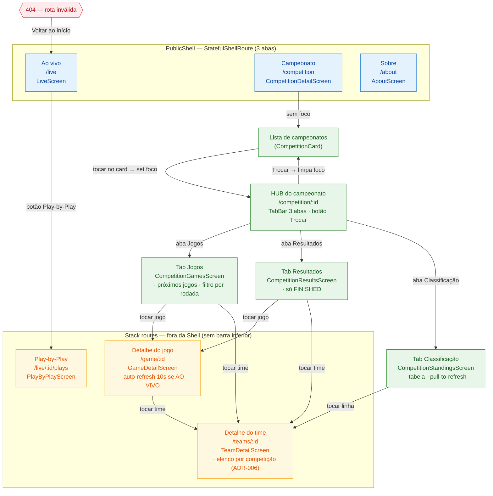

# Diagrama — Fluxo de Telas

Versão interativa do fluxo de telas do Flag Public App (renderizada com Mermaid).

> Diagrama editável (Draw.io): [flag-public-app-flow.drawio](./assets/flag-public-app-flow.drawio)

## Legenda

| Cor | Significado |
|-----|-------------|
| 🔵 Azul | Abas da navegação principal (Shell) |
| 🟢 Verde | Telas da área Campeonato |
| 🟡 Âmbar | Telas empilhadas (fora da Shell) |
| 🔴 Vermelho | Tela de erro / rota inválida |

## Notas de navegação

- A aba **Campeonato** vai para `/competition/:id` se houver campeonato em foco; senão, para `/competition` (lista).
- **Deep links** do hub: `/competition/:id/{games|results|standings}` abrem a aba correspondente.
- **Voltar (back)** nas telas empilhadas usa o back do GoRouter — retorna à tela de origem.
- O campeonato em foco é persistido em `SharedPreferences`.